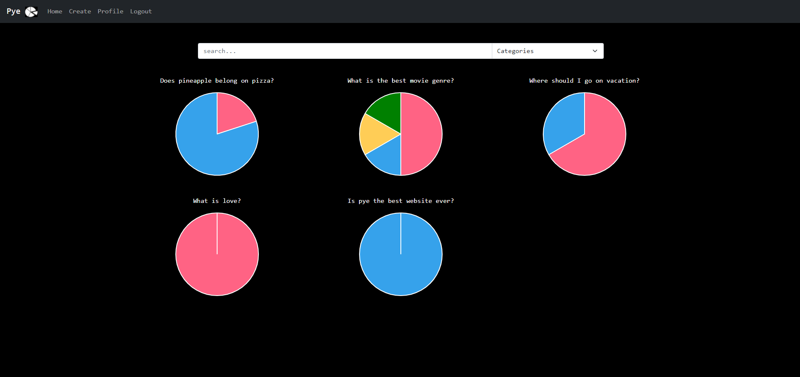
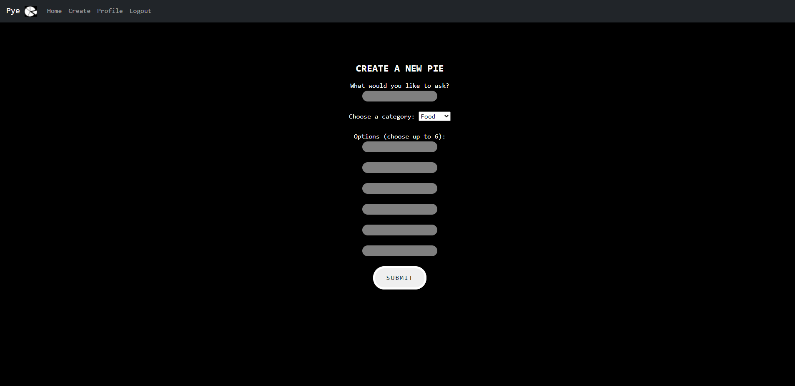
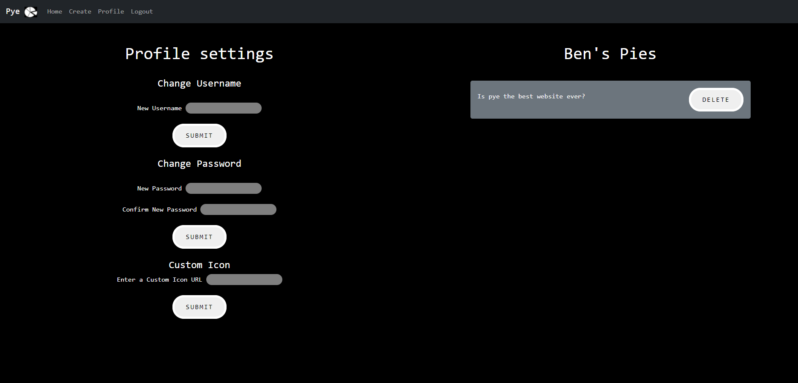

# Pye
## Description
Pye is a fun and easy polling platform for you and your friends! Prompt a question, get users to cast their votes, and instantly get the results in an easy to read pie chart! 
## Table of Contents
- [Installation](#installation)
- [Usage](#usage)
- [Credits](#credits)
- [License](#license)
## Installation
Deployed Link: [Pye](https://cryptic-basin-25278.herokuapp.com/)

## Usage
Welcome to Pye!

If you do not already have an account, sign up

Or login if you are already registered

The home page features the latest pies for you to vote on and includes a search bar

On the create tab, you can put your question onto the platform to have users vote on it

With the proile settings, you can change your username, password and icon, or delete pies that you have made

## Credits
App created by Randy Chou, Alex Bright and Ben Thackray
## License

